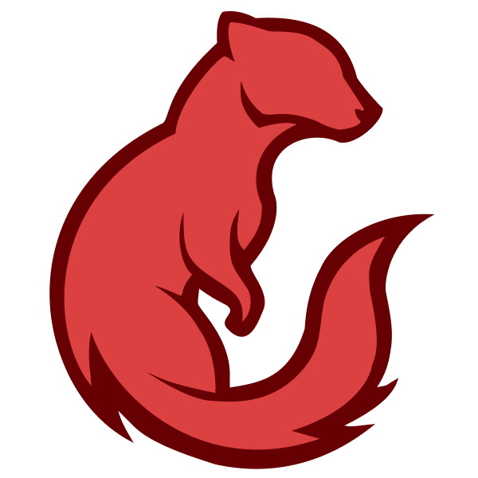
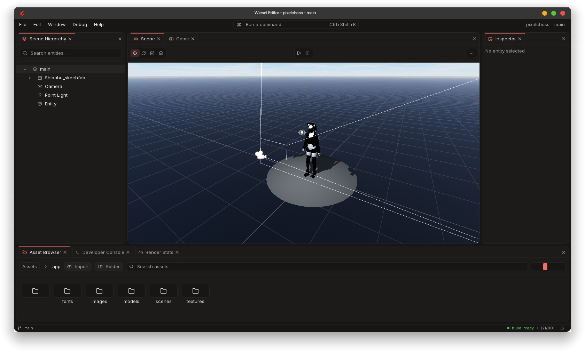
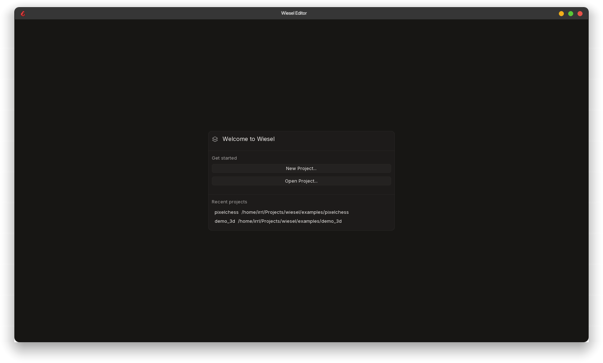

<div align="center">



# Wiesel Engine

**A cross-platform C++ game engine with a Vulkan renderer, C# scripting, and a full-featured editor.**

</div>



## Features

- **Vulkan renderer** - deferred PBR pipeline built on a render graph with dynamic rendering (Vulkan 1.4), cascaded shadow maps, **ray-traced shadows**, SSAO, image-based lighting, bloom, motion blur, TAA/FXAA, HDR tone-mapping, forward transparency, and skybox support
- **C# scripting** via Mono with hot-reload, lifecycle callbacks, collision/trigger events, and a broad engine API
- **Built-in code editor with LSP support** - autocomplete, diagnostics, semantic highlighting, hover, and syntax highlighting for C#, RML, and RCSS
- **Full editor** - scene hierarchy, component inspector, asset browser, prefabs, gizmos, play/stop with snapshot restore, undo/redo, dockable panels, developer console, and GPU memory stats
- **Jolt Physics** - multi-threaded simulation, box/sphere/capsule/mesh/heightfield colliders, baked mesh collider assets, triggers, one-way platforms, raycasting, and overlap queries
- **Networking** - entity replication with authority/ownership, snapshot interpolation, sync vars, auto-serialized RPCs, and a C# networking API
- **RmlUi support** - HTML/CSS-style game UI with data binding and hot-reload, alongside a native canvas UI system (anchors/pivots, buttons, text input, gamepad navigation)
- **Audio system** - miniaudio backend with 3D spatial sound, reverb zones, and volume buses
- **Animation system** - skeletal animation with a state machine and crossfading, plus sprite animation with sheet slicing
- **2D rendering** - sprites with atlas support, orthographic camera, 9-slice images, and custom cursors
- **Virtual file system** - mount points (`app://`, `engine://`, `editor://`) backed by physical directories or `.pak` archives, with async loading and stable `.meta` handles
- **Asset packing & game export** - pack assets, compile scripts, and produce a standalone runtime executable
- **Input system** - data-driven contexts, gamepad mapping, and up to 4-player local multiplayer
- **ECS** built on EnTT with priority-ordered systems and reflection code generation

<p align="center"></p>

## Roadmap

Planned and in-progress work:

- Particle system and cloth simulation
- Reflection probes
- LOD system with automatic generation and dithered crossfade
- Occlusion culling (HZB) and GPU instancing
- Volumetric fog and depth of field
- Upscaling (DLSS / FSR / XeSS)
- Level streaming / world partition
- Visual node-based shader and animation state-machine editors
- Coroutines and debug drawing for C# scripts
- More UI components (scroll view, slider, toggle, dropdown, masking, multiline text, SDF fonts)
- Dedicated / headless server runtime

## A Note from the Author

I started this project back in March 2023. At the time I had no idea how Vulkan worked and simply wanted to learn, so I began building Wiesel without any expectation that it would get this far. Looking back, I can safely say that most of my early decisions held up well, and I'm genuinely happy with how the overall structure of the renderer and the rest of the engine turned out. Of course, I've learned a lot more about C++ and programming in general since then, so I'm confident there's still plenty of room to improve.

My goal is to get Wiesel to a state that is stable and ready for building actual, high-quality games. I may not always work on it full time, but feel free to tinker around and open pull requests. I'm always thrilled to see people contribute to something I've built.

## Building

### Requirements
- C++23 compiler (MSVC, GCC, or Clang)
- CMake 3.24+
- Vulkan SDK
- Mono runtime

### Build
```bash
git clone --recursive https://github.com/irrld/wiesel.git
cd wiesel
cmake -B build
cmake --build build
```

Sample projects live in the [`examples/`](examples/) directory.

## Project Structure

```
wiesel/     Engine library (headers, source, shaders, C# scripts)
editor/     Editor application
runtime/    Standalone game runtime
libs/       Internal libraries (wpak, monolib)
tools/      Asset packer and build tools
vendor/     Third-party dependencies (git submodules)
```

## Third-Party Libraries

[Vulkan](https://www.vulkan.org/),
[Jolt Physics](https://github.com/jrouwe/JoltPhysics),
[SDL3](https://www.libsdl.org/) / [GLFW](https://www.glfw.org/),
[Dear ImGui](https://github.com/ocornut/imgui),
[RmlUi](https://github.com/mikke89/RmlUi),
[entt](https://github.com/skypjack/entt),
[Assimp](https://github.com/assimp/assimp),
[FreeType](https://freetype.org/),
[miniaudio](https://miniaud.io/),
[glslang](https://github.com/KhronosGroup/glslang),
[VMA](https://github.com/GPUOpen-LibrariesAndSDKs/VulkanMemoryAllocator),
[nlohmann/json](https://github.com/nlohmann/json),
[Tracy](https://github.com/wolfpld/tracy),
[Mono](https://www.mono-project.com/),
[stb](https://github.com/nothings/stb),
[Recast Navigation](https://github.com/recastnavigation/recastnavigation)

## License

Apache License 2.0
</content>
</invoke>
